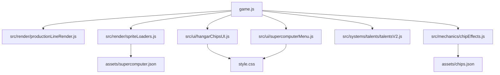

# Tank Merge Zombie Defense — Project Map

> Документ для агентов. Обновлён: 2026-03-25.
> Навигация: раздел → файл документации → строки кода.

## О проекте
Браузерная 2D HTML5 Canvas-игра без build-step и без npm: башенная оборона, merge-механика, суперкомпьютер, ангарные чипы и data-driven конфиги. Точка входа — [game.js](../../game.js#L11714-L11885) через [index.html](../../index.html); каноническая новая логика живёт в `src/*`, а `game.js` держит bootstrap и fallback wiring.

## ⚠️ Инварианты — нарушать нельзя
| Правило | Где задано |
|---|---|
| Конвейер `work` запускается от kill-hook, проигрывает полный цикл кадров и не перезапускается в середине текущего клипа. | [game.js](../../game.js#L5902-L5917), [src/render/productionLineRender.js](../../src/render/productionLineRender.js#L219-L227) |
| `New game` не равен partial reset: при `reason='new_game'` игрок стартует без бесплатных talent/update points, а суперкомпьютер — с `computerLevel = 0` и `xpToNext = 50`; snapshot partial reset сохраняет текущий прогресс. | [src/core/bootstrap.js](../../src/core/bootstrap.js#L562-L563), [game.js](../../game.js#L454-L501), [game.js](../../game.js#L7875-L7952), [src/core/worldReset.js](../../src/core/worldReset.js#L33-L142) |
| При true `new_game` стартовый `state.productionLine.firstNewGameBoxGuaranteedPending = true`: первая изготовленная коробка кладётся в storage с `guaranteedLootId='one_big_chip'`, а `openBox()` один раз резолвит её через `makeGuaranteedNewGameBigChip()` в рабочий red чип L1 (`chipId > 0`, `sourceComboKey` = sorted `modIds`, `3` уникальных base `modIds` из `1..9`); сериализация сохраняет флаг до первого открытия коробки. | [src/persistence/initialState.js](../../src/persistence/initialState.js#L123-L130), [src/mechanics/productionLine.js](../../src/mechanics/productionLine.js#L105-L122), [src/mechanics/productionLine.js](../../src/mechanics/productionLine.js#L192-L205), [src/mechanics/productionLine.js](../../src/mechanics/productionLine.js#L212-L322) |
| Progress достижений за ручной ремонт ограды, уникальные технологии модификаторов, получение дронов, streak волн без ремонта, defense order streak и hangar master level обязан сохраняться вместе с `achievements.rewarded`, `completedModifierTechs` и mirrored `state.stats.*Count`; restore/apply могут backfill'ить self-managed tech rewards только один раз. | [src/persistence/initialState.js](../../src/persistence/initialState.js#L123-L137), [src/persistence/storage.js](../../src/persistence/storage.js#L413-L481), [src/mechanics/achievements.js](../../src/mechanics/achievements.js), [game.js](../../game.js#L5150-L5200), [game.js](../../game.js#L5376-L5412) |
| Unlock-награды достижений выдаются до показа popup: `processAchievementProgress()` сначала делает `reconcileAchievementRewards(...)`, и только потом queue'ит informational modal; кнопки popup лишь закрывают окно и не gate-ят reward. Это покрывает `fence_mechanic`, `duty_shift`, `track_cleanup`, `defense_order` и `hangar_master`, а `dutyShiftDamage20000` семантически означает именно `20000 damage points`. | [game.js](../../game.js#L3254-L3275), [game.js](../../game.js#L3336-L3358), [game.js](../../game.js#L10556-L10560), [src/mechanics/achievementRewards.js](../../src/mechanics/achievementRewards.js) |
| `track_cleanup` считается по episode transitions attack mode и обязан инвалидироваться любым реальным ремонтом во время волны: manual repair сбрасывает streak сразу, а repair-drone path детектится по росту `fenceSegments[].hp` вокруг `DronesApi.step(...)`. | [game.js](../../game.js), [src/mechanics/achievements.js](../../src/mechanics/achievements.js) |
| `defense_order` считается по episode transitions attack mode и обязан инвалидироваться любым merge во время активного эпизода; invalidation через `invalidateDefenseOrderEpisode()` сразу сбрасывает streak. | [game.js](../../game.js#L3401-L3476), [src/mechanics/achievements.js](../../src/mechanics/achievements.js#L1007-L1022) |
| `assets/zombies.json` обязан держать явный числовой `Health` в `types[]`; `ZombieSprites.load()` нормализует `Health/health` в `type.health`, а `makeZombie()` использует это значение раньше балансной HP-формулы. | [assets/zombies.json](../../assets/zombies.json#L1-L120), [src/render/spriteLoaders.js](../../src/render/spriteLoaders.js#L232-L305), [game.js](../../game.js#L5676-L5687) |
| Root-анимация `buildTank` запускается только покупкой танка и живёт ровно `assets/tanks.json -> tankPrintDurationSec`; kill-hook может запускать только conveyor `work`. | [game.js](../../game.js#L3289-L3307), [src/ui/supercomputerBuildTankFx.js](../../src/ui/supercomputerBuildTankFx.js#L7-L53), [game.js](../../game.js#L5902-L5917), [game.js](../../game.js#L11374-L11382) |
| Tutorial runtime всегда выбирает first available incomplete tutorial step, а не более поздний доступный шаг; это защищает цепочки суперкомпьютера и production storage от skip-ahead и ложного автозавершения поздних шагов. | [src/ui/tutorialRuntime.js](../../src/ui/tutorialRuntime.js), [src/config/tutorialSteps.js](../../src/config/tutorialSteps.js) |
| `assets/supercomputer.json` задаёт эффекты покадрово/per-state и layout частей `conveyor` / `conveyorBox` / `storageCell`; `conveyorBox.offset.x/y` — канонический data-driven способ посадить коробку на плоскость ленты. | [assets/supercomputer.json](../../assets/supercomputer.json#L125-L237), [src/render/spriteLoaders.js](../../src/render/spriteLoaders.js#L45-L145), [src/render/spriteLoaders.js](../../src/render/spriteLoaders.js#L853-L1030), [src/render/productionLineRender.js](../../src/render/productionLineRender.js#L417-L445) |
| Модалка ящика `Военная помощь` открывается через `Game.UIModals.openCrateModal(...)`, а rewarded-ad stub capture-слушателем gate-ит `#crateGet`: реальный `claimCrateReward()` проходит только после успешного `requestRewardedAd()` и программного re-click. | [index.html](../../index.html#L179-L191), [src/ui/modals.js](../../src/ui/modals.js#L155-L195), [src/ui/adService.js](../../src/ui/adService.js#L8-L70), [game.js](../../game.js#L10108-L10197) |
| HP bar суперкомпьютера рисуется отдельным верхним overlay после основного world-render, иначе он уходит под ячейки ангара. | [game.js](../../game.js#L9339-L9398), [game.js](../../game.js#L9750-L9755) |
| Remove-кнопка craft-слота в `Разобрать` должна оставаться unclipped и сидеть в том же углу, что и close-контрол у preview `Создать чип`; цветовой смысл самого SVG-чипа при этом не меняется. | [src/ui/hangarChipsUI.js](../../src/ui/hangarChipsUI.js#L2249-L2274), [src/ui/hangarChipsUI.js](../../src/ui/hangarChipsUI.js#L2532-L2544), [style.css](../../style.css#L4599-L4652), [style.css](../../style.css#L4887-L4904) |
| `index.html` обязан подключать `src/ui/fontFloor.js`; модуль поднимает глобальный floor `12px` для DOM и canvas-текста, но skip-list обязан исключать все close/remove-варианты (`.levelModal__close`, `.crateModal__close`, `.modalClose`, `.chipCraftSlotRemove`, `.lessonProgress__close`, `[data-font-floor-ignore="true"]`). | [index.html](../../index.html#L538), [src/ui/fontFloor.js](../../src/ui/fontFloor.js#L5-L11), [src/ui/fontFloor.js](../../src/ui/fontFloor.js#L47-L48), [src/ui/fontFloor.js](../../src/ui/fontFloor.js#L84-L103) |
| Close-кнопки `crate/level/modal/lesson` и SC-overlay family используют единый 44×44 X-pattern: orange-ветка живёт в `.crateModal__close`, `.levelModal__close`, `.modalClose`, `.lessonProgress__close`, green-ветка — в `scModal__close`, `#talentOverlay .modalClose`, `.modalClose.scModal__close`; font floor не должен вмешиваться в эти селекторы, а storage modal по-прежнему включает `body.pl-storage-open` для CRT/grain overlay. | [src/ui/fontFloor.js](../../src/ui/fontFloor.js#L5-L11), [src/ui/productionLineUI.js](../../src/ui/productionLineUI.js#L44-L61), [style.css](../../style.css#L54-L68), [style.css](../../style.css#L1042-L1091), [style.css](../../style.css#L1337-L1423), [style.css](../../style.css#L1859-L1951), [style.css](../../style.css#L3116-L3164) |
| Stage active slots в Talents v2 берут иконку ветки из `TalentsV2.getTalentUi(...).icon` через `getTalentV2ActiveIconUrlByBranch()`; CSS `activeOff/activeDef/activeEco` остаётся только fallback'ом, а не primary source. | [game.js](../../game.js#L3759-L3802), [game.js](../../game.js#L8688-L8838), [style.css](../../style.css#L2395-L2406) |
| Большая логика не добавляется в `game.js`, если уже есть модуль в `src/*`; `game.js` остаётся bootstrap/fallback-монолитом. | [ARCHITECTURE.md](ARCHITECTURE.md) |

## Глобальные точки входа
| Точка входа | Файл | Строки | Назначение |
|---|---|---|---|
| `boot()` | [game.js](../../game.js#L11714-L11885) | 11714–11885 | Загрузка баланса, спрайтов, bootstrap UI/runtime |
| `loop()` | [game.js](../../game.js#L11460-L11713) | 11460–11713 | Главный simulation loop: step → draw → telemetry |
| `draw()` | [game.js](../../game.js#L9339-L9398) | 9339–9398 | Главный render-orchestrator world/HUD |
| `resetGameState()` | [game.js](../../game.js#L7875-L7952) | 7875–7952 | Full reset; path `new_game` сбрасывает свободные очки и компьютер к baseline L0 |
| `Game.SupercomputerBuildTankFx.start()` | [src/ui/supercomputerBuildTankFx.js](../../src/ui/supercomputerBuildTankFx.js#L41-L53) | 41–53 | Таймер root-анимации `buildTank` на время печати танка |
| `Game.FontFloor` | [src/ui/fontFloor.js](../../src/ui/fontFloor.js#L22-L108) | 22–108 | Глобальный floor `12px` для canvas/DOM текста; все close/remove-контролы исключаются через явный skip-лист |
| `initBoard()` | [game.js](../../game.js#L2244-L2334) | 2244–2334 | Геометрия мира, позиция суперкомпьютера, layout production line |
| `Game.ProductionLineUI.open()` | [src/ui/productionLineUI.js](../../src/ui/productionLineUI.js#L44-L61) | 44–61 | Открывает/закрывает склад коробок, toggles `body.pl-storage-open`, готовит focus trap и grid |
| `Game.HangarChipsUI.init()` | [src/ui/hangarChipsUI.js](../../src/ui/hangarChipsUI.js#L3966-L4358) | 3966–4358 | Инициализация overlay ангара, drag-drop, tooltips |
| `Game.ProductionLineRender.syncState()` | [src/render/productionLineRender.js](../../src/render/productionLineRender.js#L265-L311) | 265–311 | Синхронизация conveyor/storage runtime с `state.productionLine` |
| `Game.TalentsV2.init()` | [src/systems/talents/talentsV2.js](../../src/systems/talents/talentsV2.js#L2491-L2505) | 2491–2505 | Поднятие runtime талантов v2 |

## Разделы документации

### Карта проекта / архитектура
| Подраздел | Файл документации | Hotspot |
|---|---|---|
| Архитектура слоёв | [ARCHITECTURE.md](ARCHITECTURE.md) | |
| Главная навигация агента | [INDEX.md](INDEX.md) | [HOT] |
| Монолит `game.js` | [GAME_JS_MAP.md](GAME_JS_MAP.md) | [HOT] |
| Монолит `style.css` | [STYLE_CSS_MAP.md](STYLE_CSS_MAP.md) | [HOT] |

### Render / UI / Supercomputer
| Подраздел | Файл документации | Hotspot |
|---|---|---|
| Render / Canvas | [SYSTEMS/render.md](SYSTEMS/render.md) | [HOT] |
| UI / overlays / hangar | [SYSTEMS/ui.md](SYSTEMS/ui.md) | [HOT] |
| Assets / JSON contracts | [SYSTEMS/assets.md](SYSTEMS/assets.md) | [HOT] |
| `src/ui/hangarChipsUI.js` map | [HANGAR_CHIPS_UI_MAP.md](HANGAR_CHIPS_UI_MAP.md) | [HOT] |
| `src/ui/supercomputerMenu.js` map | [SUPERCOMPUTER_MENU_MAP.md](SUPERCOMPUTER_MENU_MAP.md) | [HOT] |
| `src/render/spriteLoaders.js` map | [SPRITE_LOADERS_MAP.md](SPRITE_LOADERS_MAP.md) | [HOT] |
| `src/render/productionLineRender.js` map | [PRODUCTION_LINE_RENDER_MAP.md](PRODUCTION_LINE_RENDER_MAP.md) | |

### Gameplay / mechanics / persistence
| Подраздел | Файл документации | Hotspot |
|---|---|---|
| Combat / projectile pipeline | [SYSTEMS/combat.md](SYSTEMS/combat.md) | |
| Achievements / reward ladders | [SYSTEMS/achievements.md](SYSTEMS/achievements.md) | |
| Chip effects runtime | [CHIP_EFFECTS_MAP.md](CHIP_EFFECTS_MAP.md) | |
| Talents v2 runtime | [TALENTS_V2_MAP.md](TALENTS_V2_MAP.md) | |
| Save / offline / restore | [SYSTEMS/save.md](SYSTEMS/save.md) | [HOT] |
| Input / pointer / drag | [SYSTEMS/input.md](SYSTEMS/input.md) | |
| World events / attack mode | [SYSTEMS/worldEvents.md](SYSTEMS/worldEvents.md) | |
| Audio / telemetry / perf | [SYSTEMS/audio.md](SYSTEMS/audio.md), [SYSTEMS/telemetry.md](SYSTEMS/telemetry.md), [SYSTEMS/perf.md](SYSTEMS/perf.md) | |

## Hotspots (git log top-20)
- [HOT] `game.js`
- [HOT] `index.html`
- [HOT] `style.css`
- [HOT] `docs/ai/INDEX.md`
- [HOT] `docs/ai/SYSTEMS/ui.md`
- [HOT] `docs/ai/SYSTEMS/assets.md`
- [HOT] `docs/ai/SYSTEMS/render.md`
- [HOT] `src/ui/supercomputerMenu.js`
- [HOT] `src/ui/hangarChipsUI.js`
- [HOT] `src/render/spriteLoaders.js`
- [HOT] `src/persistence/storage.js`

## Граф зависимостей (ключевые модули)

## Что НЕ документировано
- `dist/release/staging/*` — release mirror, неканоничный источник.
- `tools/*` и баланс-dashboard'ы — утилиты, задокументированы только точкой входа в [INDEX.md](INDEX.md).
- `DataBase/` — вне игрового runtime проекта.
- `c:\Users\hisok\.agents\.github\skills\spec-refiner\SKILL.md` — внешний skill вне game repo; его update про разумные дефолты сознательно не включён в docs/ai этого репозитория.
- Непрочитанные хвосты больших data-файлов (`assets/tanks.json`, `assets/zombies.json`) пока описаны на уровне контрактов в [SYSTEMS/assets.md](SYSTEMS/assets.md), без отдельных map-файлов.
