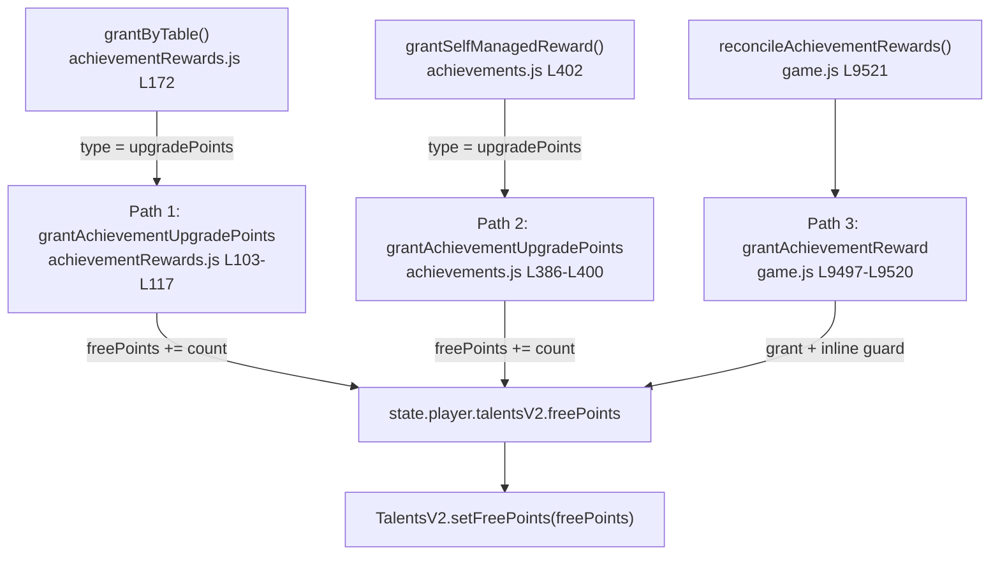

# Система: Achievements

> Обновлён: 2026-03-24. (post-merge: +stable_income family, moneyEarned progressType)

## Где править
- Definitions, family grouping, прогресс и self-managed rewards: [src/mechanics/achievements.js](../../../src/mechanics/achievements.js#L4-L512)
- Immediate reward module для non-self-managed наград и REWARD_TABLE: [src/mechanics/achievementRewards.js](../../../src/mechanics/achievementRewards.js#L1-L200)
- Gameplay hooks, lazy reward loader и informational popup render: [game.js](../../../game.js#L3254-L3275), [game.js](../../../game.js#L3336-L3388), [game.js](../../../game.js#L9267-L9357), [game.js](../../../game.js#L9418-L9425)
- Начальная save-shape и mirrored counters: [src/persistence/initialState.js](../../../src/persistence/initialState.js#L123-L137)
- I18n contract: [src/i18n/ru.json](../../../src/i18n/ru.json#L155-L193), [src/i18n/en.json](../../../src/i18n/en.json#L153-L191), [src/i18n/fallbackStrings.js](../../../src/i18n/fallbackStrings.js#L130-L162), [src/i18n/fallbackStrings.js](../../../src/i18n/fallbackStrings.js#L547-L579)
- Regression coverage: [Test/pack4/tutorial_first_run_runtime.test.js](../../../Test/pack4/tutorial_first_run_runtime.test.js#L337-L491)

## Что это
Achievements runtime теперь держит семь семейств (`creator`, `engineer`, `fence_mechanic`, `new_technology`, `duty_shift`, `track_cleanup`, `stable_income`) в одном state-machine: покупки, merge, успешные ручные ремонты ограды, уникальные исследования технологий модификаторов, получение дронов техподдержки, серию волн attack mode без ремонта фрагментов забора и суммарный заработок монет. `src/mechanics/achievements.js` остаётся canonical источником definitions/progress/dedupe, а non-self-managed награды идут через `src/mechanics/achievementRewards.js` и подхватываются `game.js` до показа informational popup.

## Инварианты
- Успешный ручной ремонт ограды увеличивает прогресс ровно один раз внутри `tryRepairFenceSegmentAt()` и только после фактического восстановления сегмента и списания монет: [game.js](../../../game.js#L6720-L6736)
- `duty_shift` использует только canonical gameplay hook `addDron(level) -> processAchievementProgress('droneAcquisitions', 1)`; прямой инкремент счётчика вне runtime hook недопустим: [game.js](../../../game.js), [src/mechanics/achievements.js](../../../src/mechanics/achievements.js)
- `track_cleanup` считает только завершённые episode attack mode и сбрасывает streak при любом реальном ремонте во время эпизода: ручной ремонт инвалидирует streak сразу, а ремонт дроном детектится через delta HP fence-сегментов до/после drone step: [game.js](../../../game.js), [src/mechanics/achievements.js](../../../src/mechanics/achievements.js)
- Прогресс технологий считается по уникальным `techId` через `achievements.completedModifierTechs`; повторный callback для уже изученной технологии не должен повторно повышать `totalModifierTechUnlocks` или выдавать reward; `recordModifierTechUnlock()` всегда вызывает `recalculateUnlocks()` даже если `alreadyTracked === true`, чтобы fixить inference race при `ensureState`: [src/mechanics/achievements.js](../../../src/mechanics/achievements.js#L711-L731), [game.js](../../../game.js#L9348-L9373)
- One-shot rewards живут в `achievements.rewarded`; `ensureState()`, `restoreFullState()`, `applySavedProgress()` и `recalculateUnlocks()` обязаны сохранять эту карту до backfill-а наград, иначе self-managed rewards задвоятся: [src/mechanics/achievements.js](../../../src/mechanics/achievements.js#L331-L391), [game.js](../../../game.js#L5150-L5200), [game.js](../../../game.js#L5376-L5412)
- `ACHIEVEMENT_FAMILIES` и `flattenAchievementFamilies()` задают canonical порядок семейств и уровней достижений; UI и runtime должны брать определения только из уже flatten'нутого списка `ACHIEVEMENTS`, не собирая family-order заново: [src/mechanics/achievements.js](../../../src/mechanics/achievements.js#L4-L183)
- Non-self-managed achievement rewards выдаются immediately: `processAchievementProgress()` сначала вызывает `reconcileAchievementRewards(unlocked)`, и только затем `queueAchievementPopup(...)`, поэтому popup `achievement_unlock` остаётся информационным. Это покрывает fence, duty_shift, track_cleanup и stable_income ladders; `dutyShiftDamage20000` трактуется как `20000 damage points`, а не как `20000 raw damage progress`: [game.js](../../../game.js#L3254-L3275), [game.js](../../../game.js#L3336-L3358), [game.js](../../../game.js#L10556-L10560), [src/mechanics/achievementRewards.js](../../../src/mechanics/achievementRewards.js)
- Achievement `upgradePoints` rewards синхронизируют TalentsV2 runtime через `TalentsV2.setFreePoints()` в трёх независимых grant-path'ах: (1) `grantAchievementUpgradePoints()` в `achievementRewards.js` L103-L116, (2) `grantAchievementUpgradePoints()` в `achievements.js` L386-L398 (для self-managed rewards), (3) `grantAchievementReward()` в `game.js` L9497-L9515. Все три пути обязаны вызывать `setFreePoints()`; пропуск sync приведёт к desync между `state.player.talentsV2.freePoints` и runtime-счётчиком TalentsV2.
- `stats.manualFenceRepairsCount`, `stats.modifierTechUnlocksCount`, `stats.droneAcquisitionsCount`, `stats.noRepairAttackWaveStreakCount` и `stats.moneyEarnedCount` зеркалят achievement totals и становятся canonical read-path, если присутствуют; legacy totals остаются fallback только для старых save payload: [src/mechanics/achievements.js](../../../src/mechanics/achievements.js), [game.js](../../../game.js)
- `stable_income` использует `moneyEarned` progressType; canonical gameplay hooks — zombie kill coins и shot coins в `game.js`, оба вызывают `processAchievementProgress('moneyEarned', coins)`: [game.js](../../../game.js#L7106), [game.js](../../../game.js#L7713)

## Ключевые блоки

### Compact contract table
`ACHIEVEMENT_FAMILIES` группирует определения по family-id, а `flattenAchievementFamilies()` превращает их в линейный `ACHIEVEMENTS` список для lookup/render/runtime checks: [src/mechanics/achievements.js](../../../src/mechanics/achievements.js#L4-L183)

| Family | Achievement IDs / thresholds | Progress type | Canonical runtime read path | Reward modes | Save fields |
|---|---|---|---|---|---|
| `creator` | `creator_novice/pro/expert` → `200 / 800 / 1600` | `purchases` | `state.stats.tanksBoughtCount` → fallback `achievements.totalPurchased` | `buy2`, `buy5`, `buyMax` | `state.stats.tanksBoughtCount`, legacy mirror `achievements.totalPurchased`, shared `achievements.unlocked/popupQueue/rewarded` |
| `engineer` | `engineer_novice/pro/expert` → `200 / 500 / 1000` | `merges` | `state.stats.tanksMergedCount` → fallback `achievements.totalMerges` | `autoMergeBasic`, `autoMergeAdvanced`, `autoMergeExpert` | `state.stats.tanksMergedCount`, legacy mirror `achievements.totalMerges`, shared `achievements.unlocked/popupQueue/rewarded` |
| `fence_mechanic` | `fence_mechanic_1..5` → `1 / 50 / 200 / 1000 / 10000` | `manualFenceRepairs` | `state.stats.manualFenceRepairsCount` → fallback `achievements.totalManualFenceRepairs` | `fenceMechanicCoins75`, `fenceMechanicDust5`, `fenceMechanicFragment1`, `fenceMechanicRandomChips2`, `fenceMechanicUpgradePoint1` | `state.stats.manualFenceRepairsCount`, legacy mirror `achievements.totalManualFenceRepairs`, shared `achievements.unlocked/popupQueue/rewarded` |
| `new_technology` | `new_technology_1..4` → `1 / 3 / 8 / 16` unique tech unlocks | `modifierTechUnlocks` | `state.stats.modifierTechUnlocksCount` → fallback `achievements.totalModifierTechUnlocks`; unique-set source is `achievements.completedModifierTechs` | `newTechnologyFragments2`, `newTechnologyDust20`, `newTechnologyRandomChips2`, `newTechnologyUpgradePoints3` | `state.stats.modifierTechUnlocksCount`, legacy mirror `achievements.totalModifierTechUnlocks`, dedupe map `achievements.completedModifierTechs`, shared `achievements.unlocked/popupQueue/rewarded` |
| `duty_shift` | `duty_shift_1..3` → `1 / 4 / 9` дронов | `droneAcquisitions` | `state.stats.droneAcquisitionsCount` → fallback `achievements.totalDroneAcquisitions` | `dutyShiftUpgradePoint1`, `dutyShiftDamage20000`, `dutyShiftUpgradePoints2` | `state.stats.droneAcquisitionsCount`, legacy mirror `achievements.totalDroneAcquisitions`, shared `achievements.unlocked/popupQueue/rewarded` |
| `track_cleanup` | `track_cleanup_1..5` → `1 / 5 / 10 / 25 / 50` clean attack waves | `noRepairAttackWaveStreak` | `state.stats.noRepairAttackWaveStreakCount` → fallback `achievements.totalNoRepairAttackWaveStreak` | `trackCleanupDamagePoints50`, `trackCleanupFragments2`, `trackCleanupUpgradePoint1`, `trackCleanupRandomChips5`, `trackCleanupUpgradePoints3` | `state.stats.noRepairAttackWaveStreakCount`, legacy mirror `achievements.totalNoRepairAttackWaveStreak`, shared `achievements.unlocked/popupQueue/rewarded` |
| `stable_income` | `stable_income_1..5` → `10K / 1M / 100M / 100B / 100T` total coins earned | `moneyEarned` | `state.stats.moneyEarnedCount` → fallback `achievements.totalMoneyEarned` | `stableIncomeDamage100`, `stableIncomeDamage1000`, `stableIncomeDamage5000`, `stableIncomeDamage20000`, `stableIncomeDamage100000` | `state.stats.moneyEarnedCount`, legacy mirror `achievements.totalMoneyEarned`, shared `achievements.unlocked/popupQueue/rewarded` |

Все 28 reward-а описаны в единой `REWARD_TABLE` внутри [src/mechanics/achievementRewards.js](../../../src/mechanics/achievementRewards.js#L140-L175); каждая запись `{ type, amount, i18nKey }` — `i18nKey` используется popup-render'ом для автоматического i18n-lookup описания награды. `grantByTable()` dispatch'ит по `entry.type` (`coins`, `dust`, `fragments`, `randomChips`, `upgradePoints`, `damagePoints`); autoMerge-записи присутствуют в таблице для полноты, но `grantByTable()` для них возвращает `false` — autoMerge остаётся UI-wired. Self-managed rewards (`newTechnology*`) тоже в таблице, но `grantSelfManagedReward()` в `achievements.js` обрабатывает их напрямую при unlock. `stable_income` family — non-self-managed, rewards (`stableIncomeDamage*`) выдаются через `grantByTable()` dispatch type `damagePoints`: [src/mechanics/achievements.js](../../../src/mechanics/achievements.js), [game.js](../../../game.js)

### Normalization, backfill и recalc
- `ensureState()` нормализует `rewarded`, `completedModifierTechs`, retro-infer'ит завершённые технологии из `Game.HangarChips.getUnlockedTechs()`, синхронизирует mirrored stats и сразу пытается добрать пропущенные self-managed rewards один раз: [src/mechanics/achievements.js](../../../src/mechanics/achievements.js#L331-L391)
- `addProgress()` инкрементит `purchases/merges/manualFenceRepairs/modifierTechUnlocks/droneAcquisitions/noRepairAttackWaveStreak/moneyEarned` через mirrored stats, если они есть, и возвращает только новые unlock ids: [src/mechanics/achievements.js](../../../src/mechanics/achievements.js)
- `recordModifierTechUnlock()` dedupe'ит `techId`, пересчитывает `totalModifierTechUnlocks` из `completedModifierTechs` и **всегда** вызывает `recalculateUnlocks()` (даже если `ensureState` уже infer'ил текущую технологию — fixит inference race): [src/mechanics/achievements.js](../../../src/mechanics/achievements.js#L711-L731)
- `recordNoRepairAttackWaveSuccess()` и `resetNoRepairAttackWaveStreak()` держат canonical streak-state для `track_cleanup`; reset идёт через runtime invalidation path, а не через UI: [src/mechanics/achievements.js](../../../src/mechanics/achievements.js)

### REWARD_TABLE — canonical reward mapping
`REWARD_TABLE` в [src/mechanics/achievementRewards.js](../../../src/mechanics/achievementRewards.js#L140-L175) — single source of truth для всех 28 reward modes. Каждая запись `{ type, amount, i18nKey }` маппит `rewardMode` → granter-тип + i18n-ключ для popup-описания. `grantByTable()` [src/mechanics/achievementRewards.js](../../../src/mechanics/achievementRewards.js#L172-L183) выполняет dispatch по `type`, а `grant()` [src/mechanics/achievementRewards.js](../../../src/mechanics/achievementRewards.js#L185-L196) оборачивает его с dedupe через `hasRewardGranted`/`markRewardGranted`. `grantAchievementUpgradePoints()` в обоих модулях (`achievementRewards.js` L103-L116, `achievements.js` L386-L398) теперь синхронизирует `TalentsV2.setFreePoints()` после инкремента `state.player.talentsV2.freePoints`. Модуль экспортирует `{ grant, REWARD_TABLE }` через `Game.AchievementRewards`.

### upgradePoints grant-paths — visual map

Три независимых call-site'а гарантируют вызов `TalentsV2.setFreePoints()` после инкремента `freePoints`, предотвращая desync между state и runtime:

| Path | Функция | Файл | Линии | Когда срабатывает |
|---|---|---|---|---|
| 1 | `grantAchievementUpgradePoints()` | `src/mechanics/achievementRewards.js` | L103–L117 | Non-self-managed rewards через `grantByTable()` dispatch |
| 2 | `grantAchievementUpgradePoints()` | `src/mechanics/achievements.js` | L386–L400 | Self-managed rewards (family `new_technology`) через `grantSelfManagedReward()` |
| 3 | `grantAchievementReward()` | `game.js` | L9497–L9520 | Fallback guard: дополнительный `setFreePoints()` + `syncPlayerTalentsV2FromApi()` после `grant()` |

### Интеграция с game.js
- `processAchievementProgress()` — canonical funnel для gameplay-событий; после `AchievementsApi.addProgress()` он синхронизирует rewards и popup queue: [game.js](../../../game.js#L3254-L3273)
- `addDron(level)` — canonical gameplay hook для `duty_shift`, а attack-mode episode tracker (`begin/finalize/invalidateNoRepairAttackWaveEpisode`) — canonical gameplay hook для `track_cleanup`: [game.js](../../../game.js)
- `ensureAchievementRewardsModule()` lazy-load'ит `src/mechanics/achievementRewards.js`, а после успешной загрузки сразу backfill'ит уже unlocked non-self-managed rewards через `reconcileAchievementRewardsForUnlocked()` и обновляет UI: [game.js](../../../game.js)
- `grantAchievementReward()` в `game.js` использует `REWARD_TABLE` из `Game.AchievementRewards` для lookup reward-mode → type/amount; если entry отсутствует или `type === 'autoMerge'` — reward skip'ается; `grant()` dispatch'ит через `grantByTable()`, а не if-else/switch; при `type === 'upgradePoints'` дополнительно синхронизирует `TalentsV2.setFreePoints()` + `syncPlayerTalentsV2FromApi()`: [game.js](../../../game.js#L9497-L9515), [src/mechanics/achievementRewards.js](../../../src/mechanics/achievementRewards.js#L140-L202)
- `openAchievementPopupEvent()` показывает title/condition/reward copy; reward-текст теперь берётся через `entry.i18nKey` из REWARD_TABLE с fallback на `def.rewardKey`: [game.js](../../../game.js#L3483-L3489); `achievementPopupClaim`, `achievementPopupDismiss` и `achievementPopupClose` все маршрутизируются в `closeAchievementPopup()`; popup toggle добавляет/удаляет `body.achievement-popup-open` для CRT/grain overlay: [game.js](../../../game.js#L3475-L3500), [game.js](../../../game.js#L9418-L9425), [game.js](../../../game.js#L10556-L10560)
- `renderAchievementsList()` перед рендером всегда вызывает recalculation и получает прогресс `manualFenceRepairs/modifierTechUnlocks` через `AchievementsApi.getProgressValue()`: [game.js](../../../game.js#L9386-L9406)

### Debug panel — canonical flow
`debugUnlockAchievementAndClaim()` [game.js](../../../game.js#L3565-L3609) использует canonical progress hooks вместо прямого bypass `unlocked[]`:
- `modifierTechUnlocks` → генерирует synthetic `techId` из `90001+` и вызывает `onModifierTechnologyUnlocked(syntheticBase)` для каждого недостающего unique unlock
- `noRepairAttackWaveStreak` → вызывает `completeNoRepairAttackWaveAchievementProgress()` N раз
- остальные progressType → вызывает `processAchievementProgress(progressType, needed)` с точным delta

Все пути завершаются `updateUI()` и возвращают `!!ach.unlocked[def.id]`.

### _unlockedTechs reconstruction
Оба `restoreFullState()` [game.js](../../../game.js#L5286)] и `applySavedProgress()` [game.js](../../../game.js#L5504)] после restore achievements state реконструируют `_unlockedTechs` из `ach.completedModifierTechs` вызовом `HangarChips.setUnlockedTechs(ach.completedModifierTechs || {})`. Это необходимо для правильного подсчёта tier-2 tech prerequisites: [game.js](../../../game.js#L5405-L5411), [game.js](../../../game.js#L5627-L5633)

### Stale-episode fallback для track_cleanup
`handleNoRepairAttackWaveTransition()` [game.js](../../../game.js#L3386-L3404)] содержит третий guard: если attack mode уже неактивен, но `noRepairAttackWaveRuntime.activeEpisodeKey` всё ещё задан (stale state между кадрами), вызывается `finalizeNoRepairAttackWaveEpisode()` для корректного завершения эпизода.

## Save и copy contract
- Новый save shape обязан стартовать с `rewarded`, `totalManualFenceRepairs`, `totalModifierTechUnlocks`, `totalDroneAcquisitions`, `totalNoRepairAttackWaveStreak`, `totalMoneyEarned`, `completedModifierTechs` и mirrored stats counters (включая `moneyEarnedCount`): [src/persistence/initialState.js](../../../src/persistence/initialState.js#L123-L143)
- Все title/desc/reward строки новых achievement ladders обязаны одновременно существовать в RU, EN и fallback словарях: [src/i18n/ru.json](../../../src/i18n/ru.json#L155-L234), [src/i18n/en.json](../../../src/i18n/en.json#L153-L232), [src/i18n/fallbackStrings.js](../../../src/i18n/fallbackStrings.js#L130-L204), [src/i18n/fallbackStrings.js](../../../src/i18n/fallbackStrings.js#L547-L639)
- Regression pack фиксирует thresholds, drone hook, no-repair streak invalidation, save restore rewarded-state, retroactive recalc и one-shot reward behaviour для `TUT-8R..TUT-8W`: [Test/pack4/tutorial_first_run_runtime.test.js](../../../Test/pack4/tutorial_first_run_runtime.test.js)
