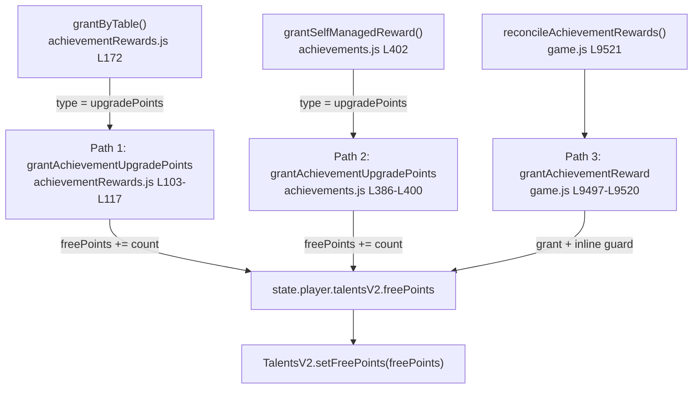

# Система: Achievements

> Обновлён: 2026-05-03. (post-merge: drone_brigadier + optimizer families, idempotent reward-claim guard)
> Дополнение: 2026-05-02. (chip_crafting/power_reserve families, reserve current+peak indicator, atomic reward grant для нового batch)

## Где править
- Definitions, family grouping, прогресс и self-managed rewards: [src/mechanics/achievements.js](../../../src/mechanics/achievements.js#L4-L512)
- Immediate reward module для non-self-managed наград и REWARD_TABLE: [src/mechanics/achievementRewards.js](../../../src/mechanics/achievementRewards.js#L1-L200)
- Gameplay hooks, lazy reward loader и informational popup render: [game.js](../../../game.js#L3254-L3275), [game.js](../../../game.js#L3336-L3388), [game.js](../../../game.js#L9267-L9357), [game.js](../../../game.js#L9418-L9425)
- Начальная save-shape и mirrored counters: [src/persistence/initialState.js](../../../src/persistence/initialState.js#L123-L137)
- I18n contract: [src/i18n/ru.json](../../../src/i18n/ru.json#L155-L193), [src/i18n/en.json](../../../src/i18n/en.json#L153-L191), [src/i18n/fallbackStrings.js](../../../src/i18n/fallbackStrings.js#L130-L162), [src/i18n/fallbackStrings.js](../../../src/i18n/fallbackStrings.js#L547-L579)
- Regression coverage: [Test/pack4/tutorial_first_run_runtime.test.js](../../../Test/pack4/tutorial_first_run_runtime.test.js#L337-L491)

## Что это
Achievements runtime теперь держит восемнадцать семейств (`creator`, `engineer`, `fence_mechanic`, `new_technology`, `chip_crafting`, `power_reserve`, `duty_shift`, `drone_brigadier`, `optimizer`, `track_cleanup`, `stable_income`, `early_capital`, `tough_perimeter`, `hangar_master`, `defense_order`, `first_elite`, `dust_master`, `fragment_collector`) в одном state-machine: покупки, merge, успешные ручные ремонты ограды, уникальные исследования технологий модификаторов, крафт чипов, резерв нераспределённых upgrade points, получение/уровни дронов техподдержки, полное покрытие ячеек ангара чипами, серию волн attack mode без ремонта фрагментов забора, суммарный lifetime-income, одновременный баланс на счету, идеальное завершение волн без повреждений ограды, минимальный уровень танков в ангаре, серию волн с пополнением без разрушений и максимальный уровень танка за всю игру. `src/mechanics/achievements.js` остаётся canonical источником definitions/progress/dedupe, а non-self-managed награды идут через `src/mechanics/achievementRewards.js` и подхватываются `game.js` до показа informational popup.

### 2026-05-03 — Drone Brigadier + Optimizer
- Добавлены семьи `drone_brigadier` (`drone_brigadier_1..2`) и `optimizer` (`optimizer_1..3`).
- `drone_brigadier` использует `progressType='droneMaxLevel'` и смотрит на фактический max-level дронов в main + underground hangar state, без отдельного инкрементального счётчика.
- `optimizer` использует `progressType='hangarCellChipTier'`: unlock-tier = минимальное число установленных чипов среди первых 15 ячеек ангара, capped до `3`.
- В UI-прогрессе `optimizer` показывает количество ячеек (из 15), удовлетворяющих `optimizerMinChips` для каждого тира.
- Reward claiming остаётся идемпотентным через `hasRewardGranted`/`markRewardGranted`; новые reward modes дополнительно включены в `ATOMIC_REWARD_MODES` для rollback-safe выдачи composite rewards.

Для `power_reserve` инвариант: unlock проверяется по текущему `unspentUpgradePoints`, а UI одновременно показывает `current` и `reservePowerPeakCycle` (пик за цикл). Для `chip_crafting` и `power_reserve` выдача наград обёрнута в atomic snapshot/rollback в `AchievementRewards.grant()`, чтобы не оставлять частично выданные composite-награды при сбое подтипа выдачи.

## Инварианты
- Успешный ручной ремонт ограды увеличивает прогресс ровно один раз внутри `tryRepairFenceSegmentAt()` и только после фактического восстановления сегмента и списания монет: [game.js](../../../game.js#L6720-L6736)
- `duty_shift` использует только canonical gameplay hook `addDron(level) -> processAchievementProgress('droneAcquisitions', 1)`; прямой инкремент счётчика вне runtime hook недопустим: [game.js](../../../game.js), [src/mechanics/achievements.js](../../../src/mechanics/achievements.js)
- `track_cleanup` считает только завершённые episode attack mode и сбрасывает streak при любом реальном ремонте во время эпизода: ручной ремонт инвалидирует streak сразу, а ремонт дроном детектится через delta HP fence-сегментов до/после drone step: [game.js](../../../game.js), [src/mechanics/achievements.js](../../../src/mechanics/achievements.js)
- `defense_order` считает завершённые episode attack mode без merge-событий; любой merge во время активного эпизода invalidate'ит streak через `invalidateDefenseOrderEpisode()`, который сразу сбрасывает `totalDefenseOrderStreak` через `resetDefenseOrderAchievementProgress()`: [game.js](../../../game.js#L3448-L3458)
- `chip_combinator_1` больше не опирается на `chips.crafted`: прогресс `chipComboTriples` идёт только от `hangar.slotChipInstalled` при `conditionMet=true` (в одной ячейке установлены 3 больших чипа в треугольные слоты и активны 3 модификатора). Ladder `chip_creator_1/2/3` (target 1/10/100, rewardModes `chipCreator1Dust15` / `chipCreator2RandomChips3Dust50` / `chipCreator3UpgradePoints3Dust200`) делит общий progress-path через `chips.crafted` и `chipCraftFromFragments`: [src/ui/hangarChipsUI.js](../../../src/ui/hangarChipsUI.js), [game.js](../../../game.js)
- Прогресс технологий считается по уникальным `techId` через `achievements.completedModifierTechs`; повторный callback для уже изученной технологии не должен повторно повышать `totalModifierTechUnlocks` или выдавать reward; `recordModifierTechUnlock()` всегда вызывает `recalculateUnlocks()` даже если `alreadyTracked === true`, чтобы fixить inference race при `ensureState`: [src/mechanics/achievements.js](../../../src/mechanics/achievements.js#L711-L731), [game.js](../../../game.js#L9348-L9373)
- One-shot rewards живут в `achievements.rewarded`; `ensureState()`, `restoreFullState()`, `applySavedProgress()` и `recalculateUnlocks()` обязаны сохранять эту карту до backfill-а наград, иначе self-managed rewards задвоятся: [src/mechanics/achievements.js](../../../src/mechanics/achievements.js#L331-L391), [game.js](../../../game.js#L5150-L5200), [game.js](../../../game.js#L5376-L5412)
- `ACHIEVEMENT_FAMILIES` и `flattenAchievementFamilies()` задают canonical порядок семейств и уровней достижений; UI и runtime должны брать определения только из уже flatten'нутого списка `ACHIEVEMENTS`, не собирая family-order заново: [src/mechanics/achievements.js](../../../src/mechanics/achievements.js#L4-L183)
- Non-self-managed achievement rewards выдаются immediately: `processAchievementProgress()` сначала вызывает `reconcileAchievementRewards(unlocked)`, и только затем `queueAchievementPopup(...)`, поэтому popup `achievement_unlock` остаётся информационным. Это покрывает fence, duty_shift, track_cleanup и stable_income ladders; `dutyShiftDamage20000` трактуется как `20000 damage points`, а не как `20000 raw damage progress`: [game.js](../../../game.js#L3254-L3275), [game.js](../../../game.js#L3336-L3358), [game.js](../../../game.js#L10556-L10560), [src/mechanics/achievementRewards.js](../../../src/mechanics/achievementRewards.js)
- `storage_worker` ladder использует `recordProductionStorageSnapshot()` (peak counters `total/level2/level4` по `state.productionLine.storage`), но **canonical grant-path не self-managed**: `productionLine.js` push/openBox/mergeBoxes seams вызывают `Game.onProductionStorageSnapshotChanged(state)` (`game.js`), который роутит возвращённый `unlocked[]` через `reconcileAchievementRewards()` + `queueAchievementPopup()` — иначе composite-награды (`storageWorker1Chips3Drone1L3`, `storageWorker2Chips5Drone2L4`, `storageWorker3Upgrade5Chips10`, все включены в `ATOMIC_REWARD_MODES`) не выдаются и popup не показывается, потому что `recalculateUnlocks()` напрямую вызывает только `grantSelfManagedReward()` (family `new_technology`): [src/mechanics/productionLine.js](../../../src/mechanics/productionLine.js), [game.js](../../../game.js), [src/mechanics/achievementRewards.js](../../../src/mechanics/achievementRewards.js)
- `production_line` family (`solo-pipeline-yandex-vk` batch#2) использует тот же `Game.onProductionStorageSnapshotChanged(state)` bridge, что и `storage_worker`, но независимый counter: `state.stats.productionBoxesOpenedByLevel = { "1": N, "4": M, ... }` инкрементируется в `openBox` seam ([src/mechanics/productionLine.js](../../../src/mechanics/productionLine.js)) **до** вызова bridge, чтобы resolver видел свежий dict. ProgressTypes — `productionBoxesOpenedAny` (сумма всех уровней) и `productionBoxesOpenedLevel4` (только ключ `'4'`); legacy mirror отсутствует, словарь инициализируется лениво (cold start / legacy save → 0). Tier 1 (`productionLine1Dust100` atomic dust) и tier 2 (`productionLine2Fragments50` atomic fragments) — single-type, но всё равно входят в `ATOMIC_REWARD_MODES` (rollback parity с `chipCreator1Dust15`). Tier 3 (`productionLine3Upgrade5Drones3L7`) — composite upgradePoints + drones level 7, обязательно atomic. Tests: [Test/pack11/productionLineUnlocks.test.js](../../../Test/pack11/productionLineUnlocks.test.js).
- Achievement `upgradePoints` rewards синхронизируют TalentsV2 runtime через `TalentsV2.setFreePoints()` в трёх независимых grant-path'ах: (1) `grantAchievementUpgradePoints()` в `achievementRewards.js` L103-L116, (2) `grantAchievementUpgradePoints()` в `achievements.js` L386-L398 (для self-managed rewards), (3) `grantAchievementReward()` в `game.js` L9497-L9515. Все три пути обязаны вызывать `setFreePoints()`; пропуск sync приведёт к desync между `state.player.talentsV2.freePoints` и runtime-счётчиком TalentsV2.
- `stats.manualFenceRepairsCount`, `stats.modifierTechUnlocksCount`, `stats.droneAcquisitionsCount`, `stats.noRepairAttackWaveStreakCount`, `stats.defenseOrderStreakCount`, `stats.moneyEarnedCount` и `stats.maxTankLevelCount` зеркалят achievement totals и становятся canonical read-path, если присутствуют; legacy totals остаются fallback только для старых save payload: [src/mechanics/achievements.js](../../../src/mechanics/achievements.js), [game.js](../../../game.js)
- `stable_income` использует `moneyEarned` progressType; canonical gameplay hooks — zombie kill coins и shot coins в `game.js`, оба вызывают `processAchievementProgress('moneyEarned', coins)`: [game.js](../../../game.js#L7106), [game.js](../../../game.js#L7713)
- `early_capital` использует `currentBalance`, а не delta-based `addProgress()`: canonical sync-path — `syncCurrentBalanceAchievements()`, который реагирует на изменение `state.coins`, вызывает `AchievementsApi.recalculateUnlocks(state)` и queue'ит popup'ы только для новых unlock'ов. Не пытаться инкрементить `currentBalance` как счётчик прогресса: [game.js](../../../game.js#L3305-L3312), [game.js](../../../game.js#L9499-L9505), [src/mechanics/achievements.js](../../../src/mechanics/achievements.js#L973-L1041)

## Ключевые блоки

### Compact contract table
`ACHIEVEMENT_FAMILIES` группирует определения по family-id, а `flattenAchievementFamilies()` превращает их в линейный `ACHIEVEMENTS` список для lookup/render/runtime checks: [src/mechanics/achievements.js](../../../src/mechanics/achievements.js#L4-L183)

| Family | Achievement IDs / thresholds | Progress type | Canonical runtime read path | Reward modes | Save fields |
|---|---|---|---|---|---|
| `creator` | `creator_novice/pro/expert` → `200 / 800 / 1600` | `purchases` | `state.stats.tanksBoughtCount` → fallback `achievements.totalPurchased` | `buy2`, `buy5`, `buyMax` | `state.stats.tanksBoughtCount`, legacy mirror `achievements.totalPurchased`, shared `achievements.unlocked/popupQueue/rewarded` |
| `engineer` | `engineer_novice/pro/expert` → `200 / 500 / 1000` | `merges` | `state.stats.tanksMergedCount` → fallback `achievements.totalMerges` | `autoMergeBasic`, `autoMergeAdvanced`, `autoMergeExpert` | `state.stats.tanksMergedCount`, legacy mirror `achievements.totalMerges`, shared `achievements.unlocked/popupQueue/rewarded` |
| `fence_mechanic` | `fence_mechanic_1..5` → `1 / 50 / 200 / 1000 / 10000` | `manualFenceRepairs` | `state.stats.manualFenceRepairsCount` → fallback `achievements.totalManualFenceRepairs` | `fenceMechanicCoins75`, `fenceMechanicDust5`, `fenceMechanicFragment1`, `fenceMechanicRandomChips2`, `fenceMechanicUpgradePoint1` | `state.stats.manualFenceRepairsCount`, legacy mirror `achievements.totalManualFenceRepairs`, shared `achievements.unlocked/popupQueue/rewarded` |
| `new_technology` | `new_technology_1..4` → `1 / 3 / 8 / 16` unique tech unlocks | `modifierTechUnlocks` | `state.stats.modifierTechUnlocksCount` → fallback `achievements.totalModifierTechUnlocks`; unique-set source is `achievements.completedModifierTechs` | `newTechnologyFragments2`, `newTechnologyDust20`, `newTechnologyRandomChips2`, `newTechnologyUpgradePoints3` | `state.stats.modifierTechUnlocksCount`, legacy mirror `achievements.totalModifierTechUnlocks`, dedupe map `achievements.completedModifierTechs`, shared `achievements.unlocked/popupQueue/rewarded` |
| `duty_shift` | `duty_shift_1..3` → `1 / 4 / 9` дронов | `droneAcquisitions` | `state.stats.droneAcquisitionsCount` → fallback `achievements.totalDroneAcquisitions` | `dutyShiftUpgradePoint1`, `dutyShiftDamage20000`, `dutyShiftUpgradePoints2` | `state.stats.droneAcquisitionsCount`, legacy mirror `achievements.totalDroneAcquisitions`, shared `achievements.unlocked/popupQueue/rewarded` |
| `track_cleanup` | `track_cleanup_1..5` → `1 / 5 / 10 / 25 / 50` clean attack waves | `noRepairAttackWaveStreak` | `state.stats.noRepairAttackWaveStreakCount` → fallback `achievements.totalNoRepairAttackWaveStreak` | `trackCleanupDamagePoints50`, `trackCleanupFragments2`, `trackCleanupUpgradePoint1`, `trackCleanupRandomChips5`, `trackCleanupUpgradePoints3` | `state.stats.noRepairAttackWaveStreakCount`, legacy mirror `achievements.totalNoRepairAttackWaveStreak`, shared `achievements.unlocked/popupQueue/rewarded` |
| `wave_survivor` | `wave_survivor_1..5` → `10 / 50 / 200 / 1000 / 5000` survived attack waves (любые, включая с ремонтом) | `attackWavesCompleted` | `state.stats.attackWavesCompletedCount` → fallback `achievements.totalAttackWavesCompleted` | `waveSurvivor1Coins2000`, `waveSurvivor2RandomChips2`, `waveSurvivor3UpgradePoints3`, `waveSurvivor4Drone1L5Chips5` (composite, atomic), `waveSurvivor5Upgrade10Damage1M` (composite, atomic) | `state.stats.attackWavesCompletedCount`, legacy mirror `achievements.totalAttackWavesCompleted`, shared `achievements.unlocked/popupQueue/rewarded` |
| `repair_crew` | `repair_crew_1..3` → `10 000 / 25 000 / 100 000` fence segment repairs completed by drones | `droneRepairsCompleted` | `state.stats.droneRepairsCompletedCount` → fallback `achievements.totalDroneRepairsCompleted` | `repairCrew1RandomChips5`, `repairCrew2DronesL3x3`, `repairCrew3DroneL9Upgrade3` (composite, atomic) | `state.stats.droneRepairsCompletedCount`, legacy mirror `achievements.totalDroneRepairsCompleted`, shared `achievements.unlocked/popupQueue/rewarded` |
| `meta_hoarder` | `meta_hoarder_1..3` → `25 / 75 / 150` cumulative unlocked achievements (lifetime; no retro-grant) | `achievementsUnlockedCount` | `state.stats.achievementsUnlockedCount` → fallback `achievements.totalAchievementsUnlocked`; canonical seam — единственный +1 в `recalculateUnlocks()` при `ach.unlocked[def.id]` false→true, исключая саму family `def.familyId === 'meta_hoarder'` (self-counting guard) | `metaHoarder1RandomChips5`, `metaHoarder2Upgrade3Damage500000` (composite, atomic), `metaHoarder3Upgrade5RandomChips15` (composite, atomic) | `state.stats.achievementsUnlockedCount`, legacy mirror `achievements.totalAchievementsUnlocked`, shared `achievements.unlocked/popupQueue/rewarded` |
| `production_line` | `production_line_1..3` → `50` any-level / `150` any-level / `50` level-4 production storage boxes opened (lifetime) | `productionBoxesOpenedAny` (tiers 1, 2), `productionBoxesOpenedLevel4` (tier 3) | `state.stats.productionBoxesOpenedByLevel = { "1": N1, "2": N2, ... }`; resolver sums all keys for `Any`, reads `['4']` for `Level4`; no legacy mirror | `productionLine1Dust100` (atomic), `productionLine2Fragments50` (atomic), `productionLine3Upgrade5Drones3L7` (composite, atomic) | `state.stats.productionBoxesOpenedByLevel` dict, shared `achievements.unlocked/popupQueue/rewarded` |
| `talent_path` | `talent_path_1..2` → `10 / 25` cumulative talent upgrade points spent (monotonic peak survives respec); `talent_path_3` → `1` fully maxed talent branch; `talent_path_4` → `3` branches with active ability at max rank | `talentPointsSpent` (tiers 1,2), `talentBranchesMaxed` (tier 3), `talentBranchActivesMaxed` (tier 4) | `state.stats.talentPointsSpentTotal` / `talentBranchesMaxedPeak` / `talentBranchActivesMaxedPeak` → fallback `achievements.totalTalentPointsSpent` / `totalTalentBranchesMaxed` / `totalTalentBranchActivesMaxed` | `talentPath1Fragments10`, `talentPath2RandomChips5Dust50` (composite, atomic), `talentPath3Upgrade3`, `talentPath4Upgrade10Damage1M` (composite, atomic) | `state.stats.talentPointsSpentTotal` / `talentBranchesMaxedPeak` / `talentBranchActivesMaxedPeak`, legacy mirrors `achievements.totalTalentPointsSpent` / `totalTalentBranchesMaxed` / `totalTalentBranchActivesMaxed`, shared `achievements.unlocked/popupQueue/rewarded` |
| `big_spender` | `big_spender_1..3` → `1 000 000 / 100 000 000 000 / 100 000 000 000 000` coins spent (across `tank`, `upgrade`, `wall`, `supercomputer`, `hangar`, `repair`, `talent` sources) | `coinsSpentTotal` | `state.stats.coinsSpentTotal` → fallback `achievements.totalCoinsSpent`; per-source breakdown in `state.stats.coinsSpentBySource` | `bigSpender1Damage10000`, `bigSpender2Chips2Upgrade2` (composite, atomic), `bigSpender3Upgrade5Chips5` (composite, atomic) | `state.stats.coinsSpentTotal`, `state.stats.coinsSpentBySource`, legacy mirror `achievements.totalCoinsSpent`, shared `achievements.unlocked/popupQueue/rewarded` |
| `stable_income` | `stable_income_1..5` → `10K / 1M / 100M / 100B / 100T` total coins earned | `moneyEarned` | `state.stats.moneyEarnedCount` → fallback `achievements.totalMoneyEarned` | `stableIncomeDamage100`, `stableIncomeDamage1000`, `stableIncomeDamage5000`, `stableIncomeDamage500M`, `stableIncomeUpgradePoints10` | `state.stats.moneyEarnedCount`, legacy mirror `achievements.totalMoneyEarned`, shared `achievements.unlocked/popupQueue/rewarded` |
| `early_capital` | `early_capital_1..5` → `10K / 1M / 100M / 100B / 100T` coins held at once | `currentBalance` | `state.coins` через `syncCurrentBalanceAchievements()` / `AchievementsApi.recalculateUnlocks(state)` | `earlyCapitalFragments2`, `earlyCapitalChips2`, `earlyCapitalDamage10000`, `earlyCapitalFragments20`, `earlyCapitalUpgrade3Drones5L2` (composite) | shared `achievements.unlocked/popupQueue/rewarded`; progress читается напрямую из текущего баланса, а не из mirrored stats |
| `tough_perimeter` | `tough_perimeter` → `1` perfect fence wave | `perfectFenceWaves` | direct check via `checkPerfectFenceWave()` in `game.js` | `toughPerimeterUpgradePoint1` | shared `achievements.unlocked/popupQueue/rewarded` |
| `hangar_master` | `hangar_master_1..5` → computed levels 1–5 (min tank level among 15 cells: 1/10/20/40/60) | `hangarMasterLevel` | `computeHangarMasterLevel()` in `game.js` (checks first 15 cells) | `hangarMasterFragmentDust10`, `hangarMasterChips2Damage5000`, `hangarMasterUpgradeDrone1`, `hangarMasterDamage50000Chips5`, `hangarMasterUpgrade3Drones2L5` (all composite) | shared `achievements.unlocked/popupQueue/rewarded`; defs carry `displayTarget:15` + `hangarMinLevel` for per-tier progress display |
| `defense_order` | `defense_order_1..5` → `5 / 10 / 25 / 50 / 100` consecutive attack waves without merge | `defenseOrderStreak` | `state.stats.defenseOrderStreakCount` → fallback `achievements.totalDefenseOrderStreak` | `defenseOrderFragments2`, `defenseOrderChips2`, `defenseOrderUpgrade1Drone1L1`, `defenseOrderUpgrade3Drones3L3`, `defenseOrderUpgrade5Chips15` | `state.stats.defenseOrderStreakCount`, legacy mirror `achievements.totalDefenseOrderStreak`, shared `achievements.unlocked/popupQueue/rewarded` |
| `first_elite` | `first_elite_1..6` → `10 / 20 / 30 / 40 / 50 / 60` max tank level | `maxTankLevel` | `state.stats.maxTankLevelCount` → fallback `achievements.totalMaxTankLevel` | `firstEliteDamage500`, `firstEliteUpgradePoint1`, `firstEliteDamage5000Chips2` (composite), `firstEliteUpgrade2Drone1L3` (composite), `firstEliteUpgrade3Drones2L5` (composite), `firstEliteUpgrade5Damage50000` (composite) | `state.stats.maxTankLevelCount`, legacy mirror `achievements.totalMaxTankLevel`, shared `achievements.unlocked/popupQueue/rewarded` |
| `auto_merge_addict` | `auto_merge_addict_1..5` → `5 000 / 10 000 / 20 000 / 50 000 / 100 000` авто-merge пар | `autoMergeActivations` | `state.stats.autoMergeActivationsCount` → fallback `achievements.totalAutoMergeActivations`; counter seam — `runAutoMerge()` в [src/mechanics/autoMerge.js](../../../src/mechanics/autoMerge.js) (учитываются только реально объединённые пары, не клики по кнопке) | `autoMergeAddict1Dust25Fragments10`, `autoMergeAddict2Upgrade1Chips5`, `autoMergeAddict3Damage100000Drones3L3`, `autoMergeAddict4Upgrade3Chips15`, `autoMergeAddict5Drones6L6Damage1M` (все composite, в `ATOMIC_REWARD_MODES`) | `state.stats.autoMergeActivationsCount`, legacy mirror `achievements.totalAutoMergeActivations`, shared `achievements.unlocked/popupQueue/rewarded` |
| `conveyor_master` | `conveyor_master_1..5` → `10 000 / 25 000 / 50 000 / 100 000 / 250 000` созданных танков | `purchases` (reuse existing counter; new high-end ladder поверх `creator`) | `state.stats.tanksBoughtCount` → fallback `achievements.totalPurchased`; canonical seam — single buy `game.js` ~L4891 и bulk buy `game.js` ~L4913 (NO retro-grant: standard `rewarded[id]` gate, без массовых popup на первом загрузе) | `conveyorMaster1Dust75`, `conveyorMaster2Fragments25Chips5`, `conveyorMaster3Drones5L4`, `conveyorMaster4Upgrade5Dust150`, `conveyorMaster5Damage10MDrones2L8` (все composite, в `ATOMIC_REWARD_MODES`) | share with `creator` family — `state.stats.tanksBoughtCount`, legacy mirror `achievements.totalPurchased`, shared `achievements.unlocked/popupQueue/rewarded` |
| `dust_master` | `dust_master_1..3` → `500 / 2 500 / 10 000` кремниевой пыли за игру (lifetime) | `dustEarnedLifetime` | `state.stats.dustEarnedLifetime` → fallback `achievements.dustEarnedLifetime`; canonical inflow seam — `Game.HangarChipsUI.creditSiliconDust(amount, source)` ([src/ui/hangarChipsUI.js](../../../src/ui/hangarChipsUI.js)) вызывается из achievement rewards, shop bundles, production-line loot и workshop disassemble; bump-helper `_bumpDustEarnedLifetime` дополнительно вызывает `_triggerAchievementSweep()` → `Game.recalculateAchievementsAndQueuePopups()`, чтобы unlock + reward + popup срабатывали в момент пересечения порога, а не только при открытии модалки достижений | `dustMaster1RandomFragments10`, `dustMaster2RandomChips10`, `dustMaster3UpgradePoints3DronesL7x3` (composite) | `state.stats.dustEarnedLifetime`, legacy mirror `achievements.dustEarnedLifetime`, shared `achievements.unlocked/popupQueue/rewarded` |
| `fragment_collector` | `fragment_collector_1..3` → `50 / 250 / 1 000` фрагментов за игру (lifetime) | `fragmentsAcquired` | `state.stats.fragmentsAcquired` → fallback `achievements.fragmentsAcquired`; canonical inflow seam — `Game.HangarChipsUI.addPlayerFragment(fragmentId, count)` ([src/ui/hangarChipsUI.js](../../../src/ui/hangarChipsUI.js)) → bump-helper `_bumpFragmentsAcquired` инкрементит счётчик и вызывает `_triggerAchievementSweep()` → `Game.recalculateAchievementsAndQueuePopups()`, чтобы unlock + reward + popup срабатывали в момент пересечения порога | `fragmentCollector1Dust50`, `fragmentCollector2Dust500`, `fragmentCollector3UpgradePoints3DronesL7x3` (composite, идентичен `dustMaster3UpgradePoints3DronesL7x3` — by design) | `state.stats.fragmentsAcquired`, legacy mirror `achievements.fragmentsAcquired`, shared `achievements.unlocked/popupQueue/rewarded` |

### dust_master family (ADR — lifetime dust counter)
- `state.stats.dustEarnedLifetime` — монотонный счётчик positive-delta инфлоу кремниевой пыли. Он переживает partial reset (workshop reset / shop rebalance) и full reset; никогда не уменьшается; обновляется ровно одним canonical seam — `Game.HangarChipsUI.creditSiliconDust(amount, source)` в [src/ui/hangarChipsUI.js](../../../src/ui/hangarChipsUI.js). Snapshot rollback (`achievementRewards.applyDustSnapshot`) и прямые `setSiliconDust()` writes этот счётчик НЕ трогают — иначе atomic rollback повторно засчитал бы lifetime.
- Все call-site'ы dust-inflow обязаны идти через `creditSiliconDust`: achievement reward grant (`grantAchievementDust` → `creditSiliconDust(total, 'achievement-reward')`), shop bundle apply (`applyBundle._grantSiliconDust` → `creditSiliconDust(dust, 'shop-bundle')`), production-line loot box (`productionLine.js` ten_silicon_dust + five_silicon_dust → `creditSiliconDust(N, 'production-line-loot')`), workshop disassemble subtab (`hangarChipsUI.js` ~L4302 → `creditSiliconDust(totalDust, 'workshop-recycle-dust')`).
- Auto-grant wiring: `_bumpDustEarnedLifetime` после инкремента `state.stats.dustEarnedLifetime` вызывает `_triggerAchievementSweep()`, который проходит через `Game.recalculateAchievementsAndQueuePopups()` (canonical sweep, такой же контракт как `syncCurrentBalanceAchievements` для `early_capital`). Это гарантирует, что `dust_master_1/2/3` unlock + grant + popup происходят в момент пересечения порога, а не только при открытии модалки достижений.
- Параллельно поддерживается аналогичный seam для будущей `fragment_collector` family: `state.stats.fragmentsAcquired` бампится из `Game.HangarChipsUI.addPlayerFragment(fragmentId, count)` через `_bumpFragmentsAcquired` + тот же `_triggerAchievementSweep()`.

### fragment_collector family (ADR — lifetime fragments counter)
- `state.stats.fragmentsAcquired` — монотонный счётчик positive-delta инфлоу фрагментов чипов. Переживает partial reset (workshop reset / shop rebalance) и full reset; никогда не уменьшается; обновляется ровно одним canonical seam — `Game.HangarChipsUI.addPlayerFragment(fragmentId, count)` в [src/ui/hangarChipsUI.js](../../../src/ui/hangarChipsUI.js). Прямые мутации `state.fragments[*]` или snapshot rollback этот счётчик НЕ трогают.
- Все call-site'ы fragment inflow обязаны идти через `addPlayerFragment`: achievement reward grant (`fragments` type → `grantAchievementFragments` → `addPlayerFragment` chain), shop bundle apply, production-line loot box, workshop crafting drops. Counter bump происходит только при positive `count` — отрицательные delta (расход фрагментов на крафт) счётчик игнорирует.
- Auto-grant wiring: `_bumpFragmentsAcquired` после инкремента `state.stats.fragmentsAcquired` вызывает `_triggerAchievementSweep()` → `Game.recalculateAchievementsAndQueuePopups()` (canonical sweep, same контракт как `_bumpDustEarnedLifetime` для `dust_master`). Это гарантирует, что `fragment_collector_1/2/3` unlock + grant + popup происходят в момент пересечения порога, а не только при открытии модалки достижений.
- Reward parity: `fragment_collector_3` использует `composite(upgradePoints:3 + drones:3 level:7)` — этот reward intentionally идентичен `dust_master_3` (by design, не баг). Reward mappings в `REWARD_TABLE`: `fragmentCollector1Dust50`, `fragmentCollector2Dust500`, `fragmentCollector3UpgradePoints3DronesL7x3` (composite). Composite reward сам по себе rollback-safe через стандартный `grantAchievementUpgradePoints` + `grantAchievementDrones` cascade (deferred slot при overflow), parity с `dust_master_3` не требует добавления в `ATOMIC_REWARD_MODES`.

Все 65 reward-mapping'ов описаны в единой `REWARD_TABLE` внутри [src/mechanics/achievementRewards.js](../../../src/mechanics/achievementRewards.js); каждая запись `{ type, amount, i18nKey }` — `i18nKey` используется popup-render'ом для автоматического i18n-lookup описания награды. `grantByTable()` dispatch'ит по `entry.type` (`coins`, `dust`, `fragments`, `randomChips`, `upgradePoints`, `damagePoints`, `composite`); autoMerge-записи присутствуют в таблице для полноты, но `grantByTable()` для них возвращает `false` — autoMerge остаётся UI-wired. Self-managed rewards (`newTechnology*`) тоже в таблице, но `grantSelfManagedReward()` в `achievements.js` обрабатывает их напрямую при unlock. `stable_income` и `early_capital` — разные ladders: первый выдаёт награды за lifetime income, второй за моментальный баланс на счёте: [src/mechanics/achievements.js](../../../src/mechanics/achievements.js), [game.js](../../../game.js)

`early_capital` — 5-tier family; определения живут рядом со `stable_income`, но используют `progressType = 'currentBalance'` и reward ladder `fragments → chips → damagePoints → fragments → composite(upgradePoints + drones level 2)`: [src/mechanics/achievements.js](../../../src/mechanics/achievements.js#L315-L366), [src/mechanics/achievementRewards.js](../../../src/mechanics/achievementRewards.js#L178-L182)

`tough_perimeter` — single-tier family; `checkPerfectFenceWave()` в `game.js` L3481 итерирует `state.fenceSegments` с `continue` для invalid/zero-maxHp сегментов (а не `return`), добавлен guard `seg.maxHp <= 0`; при всех `hp >= maxHp` вызывает `processAchievementProgress('perfectFenceWaves', 1)`: [game.js](../../../game.js#L3481-L3490)

`hangar_master` — 5-tier family; `computeHangarMasterLevel()` в `game.js` L3491 проверяет первые **15** ячеек (не 16), находит минимальный level среди них и маппит на tier (1/10/20/40/60 → level 1–5). `computeHangarCellCountForMinLevel(minLevel)` в `game.js` L3508 возвращает количество ячеек ≥ minLevel (из первых 15) — используется UI для per-tier progress display. Defs несут `displayTarget:15` (для UI progress bar) и `hangarMinLevel` (пороговый level для каждого tier). `achievementsModal.js` L100 использует `displayTarget` вместо `target` для отображения прогресса, а `renderAchievementsList()` в `game.js` L9828 передаёт `computeHangarCellCountForMinLevel(def.hangarMinLevel)` как текущий прогресс: [game.js](../../../game.js#L3491-L3530), [src/ui/achievementsModal.js](../../../src/ui/achievementsModal.js#L100-L147)

`defense_order` — 5-tier family; использует streak-механизм analogous to `track_cleanup`. Runtime `defenseOrderRuntime` в `game.js` L3401 держит `activeEpisodeKey` и `invalidated` flag. Episode начинается вместе с attack mode (`beginDefenseOrderEpisode()`), инвалидируется merge-событием (`invalidateDefenseOrderEpisode()`) и завершается при выходе из attack mode (`finalizeDefenseOrderEpisode()`). При успешном завершении вызывается `completeDefenseOrderAchievementProgress()`, который делегирует `AchievementsApi.recordDefenseOrderWaveSuccess(state)`. Reset streak'а через `resetDefenseOrderAchievementProgress()` → `AchievementsApi.resetDefenseOrderStreak(state)`. Rewards включают composite-записи (upgradePoints+drones, upgradePoints+randomChips): [game.js](../../../game.js#L3401-L3476), [src/mechanics/achievements.js](../../../src/mechanics/achievements.js#L1007-L1022)

### Normalization, backfill и recalc
- `ensureState()` нормализует `rewarded`, `completedModifierTechs`, **всегда** мержит retro-inferred технологии из `Game.HangarChips.getUnlockedTechs()` в `completedModifierTechs` (не только когда map пуст, но и для частично заполненных save — фикс потери tier-2 tech progress), синхронизирует mirrored stats и сразу пытается добрать пропущенные self-managed rewards один раз: [src/mechanics/achievements.js](../../../src/mechanics/achievements.js#L331-L391)
- `reconcileUnlockedTechsFromData(chips, cells, fragments)` в `hangarChips.js` выводит `_unlockedTechs` из реальных данных инвентаря (modIds чипов, ячеек ангара и фрагментов в диапазоне 15-30), восстанавливая prerequisite-цепочки из `TECH_TREE`; обе restore-ветки в `game.js` вызывают эту функцию после `setUnlockedTechs(completedModifierTechs)` и синхронизируют вновь найденные techs обратно в `completedModifierTechs` + stats counters: [src/mechanics/hangarChips.js](../../../src/mechanics/hangarChips.js#L653-L700), [game.js](../../../game.js#L5473-L5498), [game.js](../../../game.js#L5723-L5748)
- `addProgress()` инкрементит `purchases/merges/manualFenceRepairs/modifierTechUnlocks/droneAcquisitions/noRepairAttackWaveStreak/defenseOrderStreak/moneyEarned` через mirrored stats, если они есть, и возвращает только новые unlock ids: [src/mechanics/achievements.js](../../../src/mechanics/achievements.js)
- `recordModifierTechUnlock()` dedupe'ит `techId`, пересчитывает `totalModifierTechUnlocks` из `completedModifierTechs` и **всегда** вызывает `recalculateUnlocks()` (даже если `ensureState` уже infer'ил текущую технологию — fixит inference race): [src/mechanics/achievements.js](../../../src/mechanics/achievements.js#L711-L731)
- `recordNoRepairAttackWaveSuccess()` и `resetNoRepairAttackWaveStreak()` держат canonical streak-state для `track_cleanup`; reset идёт через runtime invalidation path, а не через UI: [src/mechanics/achievements.js](../../../src/mechanics/achievements.js)
- `recordDefenseOrderWaveSuccess()` и `resetDefenseOrderStreak()` держат canonical streak-state для `defense_order`; аналогичная pattern track_cleanup, но инвалидация при merge, а не при ремонте: [src/mechanics/achievements.js](../../../src/mechanics/achievements.js#L1007-L1022)

### REWARD_TABLE — canonical reward mapping
`REWARD_TABLE` в [src/mechanics/achievementRewards.js](../../../src/mechanics/achievementRewards.js#L140-L203) — single source of truth для всех 52 reward mappings. Каждая запись `{ type, amount, i18nKey }` маппит `rewardMode` → granter-тип + i18n-ключ для popup-описания. Тип `composite` (для `early_capital`, `hangar_master`, `defense_order`, `first_elite`) несёт `items[]` с sub-grants (напр. `upgradePoints`+`drones`, `damagePoints`+`randomChips`). `grantByTable()` [src/mechanics/achievementRewards.js](../../../src/mechanics/achievementRewards.js#L258-L276) выполняет dispatch по `type`, а `grant()` [src/mechanics/achievementRewards.js](../../../src/mechanics/achievementRewards.js#L280-L290) оборачивает его с dedupe через `hasRewardGranted`/`markRewardGranted`. `grantAchievementUpgradePoints()` в обоих модулях (`achievementRewards.js` L103-L116, `achievements.js` L386-L398) теперь синхронизирует `TalentsV2.setFreePoints()` после инкремента `state.player.talentsV2.freePoints`. Модуль экспортирует `{ grant, claimDeferredRewards, REWARD_TABLE }` через `Game.AchievementRewards`.

### Deferred rewards и overflow
`grantAchievementDrones(count, level, state)` в [src/mechanics/achievementRewards.js](../../../src/mechanics/achievementRewards.js) реализует 3-tier cascade: (1) main drone slots через `addDron()`, (2) underground hangar free cell, (3) defer в `state.achievements.deferredRewards[]`. `claimDeferredRewards(state)` повторно проходит deferred list через тот же cascade и возвращает количество успешно выданных дронов. Нераздаточные элементы остаются в массиве. Кнопка «Получить награду» в `achievementsModal.js` вызывает `claimDeferredRewards()` через callback `onClaimDeferred`, переданный из `renderAchievementsList()` в `game.js`.

### first_elite family
`first_elite` — 6-tier family; использует `maxTankLevel` progressType с SET-семантикой (не инкремент, а `if (level > current) stats.maxTankLevelCount = level`). Canonical gameplay hook — `recordTankLevel(level)` в `game.js`, который при `grewMax === true` вызывает `processAchievementProgress('maxTankLevel', nextLevel)`. `ensureStats()` синхронизирует `maxTankLevelCount` из `state.maxTankLevelAchieved` при инициализации. Rewards включают 4 composite-записи с sub-grants (дроны + upgradePoints, дроны + damagePoints и т.д.).

### early_capital family
`early_capital` — 5-tier family; использует `currentBalance` как read-only progressType, поэтому canonical trigger живёт не в `processAchievementProgress()`, а в `syncCurrentBalanceAchievements()`. Функция кэширует `lastAchievementCoinsSync`, сравнивает его с `state.coins`, и при реальном изменении вызывает `AchievementsApi.recalculateUnlocks(state)`; после этого reward reconcile и popup queue отрабатывают тем же путём, что и у остальных non-self-managed achievements. Это отделяет current-balance ladder от `stable_income`, где прогресс растёт по lifetime-earned coin deltas: [game.js](../../../game.js#L3305-L3312), [game.js](../../../game.js#L9499-L9505), [src/mechanics/achievements.js](../../../src/mechanics/achievements.js#L978-L1041)

### upgradePoints grant-paths — visual map

Три независимых call-site'а гарантируют вызов `TalentsV2.setFreePoints()` после инкремента `freePoints`, предотвращая desync между state и runtime:

| Path | Функция | Файл | Линии | Когда срабатывает |
|---|---|---|---|---|
| 1 | `grantAchievementUpgradePoints()` | `src/mechanics/achievementRewards.js` | L103–L117 | Non-self-managed rewards через `grantByTable()` dispatch |
| 2 | `grantAchievementUpgradePoints()` | `src/mechanics/achievements.js` | L386–L400 | Self-managed rewards (family `new_technology`) через `grantSelfManagedReward()` |
| 3 | `grantAchievementReward()` | `game.js` | L9497–L9520 | Fallback guard: дополнительный `setFreePoints()` + `syncPlayerTalentsV2FromApi()` после `grant()` |

### Интеграция с game.js
- `processAchievementProgress()` — canonical funnel для gameplay-событий; после `AchievementsApi.addProgress()` он синхронизирует rewards и popup queue: [game.js](../../../game.js#L3254-L3273)
- `syncCurrentBalanceAchievements()` — отдельный canonical funnel для `currentBalance`/`early_capital`: вызывается из `updateUI()` после изменений монет, избегает лишнего recalc через `lastAchievementCoinsSync` и queue'ит popup'ы только для новых unlock'ов: [game.js](../../../game.js#L3305-L3312), [game.js](../../../game.js#L9499-L9505)
- `addDron(level)` — canonical gameplay hook для `duty_shift`, а attack-mode episode tracker (`begin/finalize/invalidateNoRepairAttackWaveEpisode`) — canonical gameplay hook для `track_cleanup`; defense_order episode tracker (`begin/finalize/invalidateDefenseOrderEpisode`) — canonical gameplay hook для `defense_order`; оба tracker'а стартуют и завершаются в `handleNoRepairAttackWaveTransition()`: [game.js](../../../game.js#L3460-L3476)
- `wave_survivor` использует `attackWavesCompleted` progressType и считает **каждую** пережитую attack-wave episode независимо от ремонта забора. Canonical hook — `completeAttackEpisodeAchievementProgress()` в `game.js`, вызываемый из `finalizeNoRepairAttackWaveEpisode()` **до** гейта `if (!shouldCount) return;` (то есть до фильтра no-repair streak), а recorder в API — `recordAttackEpisodeCompleted(state)` в [src/mechanics/achievements.js](../../../src/mechanics/achievements.js).
- `repair_crew` использует `droneRepairsCompleted` progressType. Canonical seam — единственная точка восстановления `seg.hp` до `seg.maxHp` в `stepRepairWork()` в [src/mechanics/drones.js](../../../src/mechanics/drones.js): после успешного cap-branch вызывается `Game.onDroneRepairCompleted(state)` в `game.js` (с fallback на прямой `Game.Achievements.recordDroneRepairCompleted(state)` для unit-test контекстов без game.js wiring). Bridge `onDroneRepairCompleted` обязателен для composite reward (`repair_crew_3`: 1 drone lv.9 + 3 upgrade points) — он маршрутизирует unlocked[] через `reconcileAchievementRewards()` + `queueAchievementPopup()`. Recorder в API — `recordDroneRepairCompleted(state)`; reset — `resetDroneRepairsCompleted(state)`. Канонический counter — `state.stats.droneRepairsCompletedCount` (legacy mirror `achievements.totalDroneRepairsCompleted`), оба синхронизируются через `ensureStats()` migration block. No retro-grant: standard `rewarded[id]` gate.
- `talent_path` использует три progressType: `talentPointsSpent` (cumulative spend, мониторно растёт даже при respec), `talentBranchesMaxed` (peak число полностью прокачанных ветвей), `talentBranchActivesMaxed` (peak число веток с активной способностью на максимальном ранге). Canonical seam — успешная покупка ранга в [src/systems/talents/talentsV2.js](../../../src/systems/talents/talentsV2.js): `buyRank()` (single purchase) и `applyPending()` (batch confirm) после `persistSave()` вызывают `emitTalentRanksPurchased(ranksDelta)`, который роутит детали через `global.Game.onTalentRanksPurchased({ ranksDelta, branches })`. Branch snapshot строится через `getTalentBranchSnapshotForAchievements()` — он итерируется по `TALENT_PATH_BRANCH_IDS = ['offense','defense','economy']` и возвращает per-branch `{ rankSum, maxRankSum, fullyMaxed, activeRank, activeMaxRank, activeMaxed }`. Active ability IDs (`off_active_barrage` / `def_active_dome` / `eco_active_golden_hour`) дублируются в talentsV2 локально с cross-ref комментарием на canonical map в `game.js` L5875–5879 (избегаем bootstrap-order coupling). Bridge `Game.onTalentRanksPurchased(detail, stateArg)` в [game.js](../../../game.js) валидирует payload, использует `stateArg || state` fallback (mirror drones.js pattern), вызывает `Game.Achievements.recordTalentRanksPurchased(target, detail)`, затем `reconcileAchievementRewards()` + `queueAchievementPopup()` loop. Recorder `recordTalentRanksPurchased(state, detail)` обновляет `state.stats.talentPointsSpentTotal` (cumulative add `ranksDelta`) и `state.stats.talentBranchesMaxedPeak` / `state.stats.talentBranchActivesMaxedPeak` через `Math.max(current, observed)` monotonic clamp поверх snapshot. Composite rewards `talentPath2RandomChips5Dust50` (5 random chips + 50 dust) и `talentPath4Upgrade10Damage1M` (10 upgrade points + 1,000,000 damage points) — маршрутизируются через external `REWARD_TABLE` + ATOMIC_REWARD_MODES (НЕ через LOCAL_SELF_MANAGED_REWARD_TABLE: composite rewards никогда не зеркалятся локально). Reset — `resetTalentPathProgress(state)` обнуляет три counter'а и три legacy mirror. Канонические counters — `state.stats.talentPointsSpentTotal` / `talentBranchesMaxedPeak` / `talentBranchActivesMaxedPeak` (legacy mirrors `achievements.totalTalentPointsSpent` / `totalTalentBranchesMaxed` / `totalTalentBranchActivesMaxed`), синхронизируются через `ensureStats()` migration block с `Math.max(normalizeCounter(...), legacy*)` mirror. No retro-grant: standard `rewarded[id]` gate.
- `big_spender` использует `coinsSpentTotal` progressType. Recorder — `recordCoinsSpent(state, delta, source)` в [src/mechanics/achievements.js](../../../src/mechanics/achievements.js); вызывается через `recordCoinsSpentForBigSpender(amount, source)` в `game.js` после каждого `state.coins -= cost` (tank-покупки surface/underground, talent-respec, manual fence repair) и напрямую из [src/mechanics/drones.js](../../../src/mechanics/drones.js) при auto-repair coin tick. `source` ограничен набором `{ tank, upgrade, wall, supercomputer, hangar, repair, talent }`; per-source breakdown пишется в `state.stats.coinsSpentBySource`. Никакого retro-grant для старых сохранений нет — счётчики стартуют с 0 на момент migration. При превышении `Number.MAX_SAFE_INTEGER` выводится one-shot dev-warning.
- `ensureAchievementRewardsModule()` lazy-load'ит `src/mechanics/achievementRewards.js`, а после успешной загрузки сразу backfill'ит уже unlocked non-self-managed rewards через `reconcileAchievementRewardsForUnlocked()` и обновляет UI: [game.js](../../../game.js)
- `grantAchievementReward()` в `game.js` использует `REWARD_TABLE` из `Game.AchievementRewards` для lookup reward-mode → type/amount; если entry отсутствует или `type === 'autoMerge'` — reward skip'ается; `grant()` dispatch'ит через `grantByTable()`, а не if-else/switch; при `type === 'upgradePoints'` дополнительно синхронизирует `TalentsV2.setFreePoints()` + `syncPlayerTalentsV2FromApi()`: [game.js](../../../game.js#L9497-L9515), [src/mechanics/achievementRewards.js](../../../src/mechanics/achievementRewards.js#L140-L202)
- `openAchievementPopupEvent()` показывает title/condition/reward copy; reward-текст берётся через `entry.i18nKey` из REWARD_TABLE с fallback на `def.rewardKey`: [game.js](../../../game.js#L3646-L3669). `achievementPopupClaim`, `achievementPopupDismiss` и `achievementPopupClose` все маршрутизируются в `closeAchievementPopup()`, а popup toggle добавляет/удаляет `body.achievement-popup-open` для CRT/grain overlay: [game.js](../../../game.js#L9925-L9933), [game.js](../../../game.js#L11066-L11070)
- `renderAchievementsList()` перед рендером всегда вызывает recalculation и получает прогресс `manualFenceRepairs/modifierTechUnlocks` через `AchievementsApi.getProgressValue()`: [game.js](../../../game.js#L9386-L9406)

### Debug panel — canonical flow
`debugUnlockAchievementAndClaim()` [game.js](../../../game.js#L3565-L3609) использует canonical progress hooks вместо прямого bypass `unlocked[]`:
- `modifierTechUnlocks` → генерирует synthetic `techId` из `90001+` и вызывает `onModifierTechnologyUnlocked(syntheticBase)` для каждого недостающего unique unlock
- `noRepairAttackWaveStreak` → вызывает `completeNoRepairAttackWaveAchievementProgress()` N раз
- остальные progressType → вызывает `processAchievementProgress(progressType, needed)` с точным delta

Все пути завершаются `updateUI()` и возвращают `!!ach.unlocked[def.id]`.

### _unlockedTechs reconstruction
Оба `restoreFullState()` [game.js](../../../game.js#L5286)] и `applySavedProgress()` [game.js](../../../game.js#L5504)] после restore achievements state реконструируют `_unlockedTechs` из `ach.completedModifierTechs` вызовом `HangarChips.setUnlockedTechs(ach.completedModifierTechs || {})`. Это необходимо для правильного подсчёта tier-2 tech prerequisites: [game.js](../../../game.js#L5405-L5411), [game.js](../../../game.js#L5627-L5633)

### Stale-episode fallback для track_cleanup
`handleNoRepairAttackWaveTransition()` [game.js](../../../game.js#L3386-L3404)] содержит третий guard: если attack mode уже неактивен, но `noRepairAttackWaveRuntime.activeEpisodeKey` всё ещё задан (stale state между кадрами), вызывается `finalizeNoRepairAttackWaveEpisode()` для корректного завершения эпизода.

## Save и copy contract
- Новый save shape обязан стартовать с `rewarded`, `totalManualFenceRepairs`, `totalModifierTechUnlocks`, `totalDroneAcquisitions`, `totalNoRepairAttackWaveStreak`, `totalDefenseOrderStreak`, `totalMoneyEarned`, `totalMaxTankLevel`, `deferredRewards`, `completedModifierTechs` и mirrored stats counters (включая `moneyEarnedCount`, `defenseOrderStreakCount`, `maxTankLevelCount`): [src/persistence/initialState.js](../../../src/persistence/initialState.js#L123-L143)
- Все title/desc/reward строки новых achievement ladders обязаны одновременно существовать в RU, EN и fallback словарях: [src/i18n/ru.json](../../../src/i18n/ru.json#L155-L234), [src/i18n/en.json](../../../src/i18n/en.json#L153-L232), [src/i18n/fallbackStrings.js](../../../src/i18n/fallbackStrings.js#L130-L204), [src/i18n/fallbackStrings.js](../../../src/i18n/fallbackStrings.js#L547-L639)
- Regression pack фиксирует thresholds, drone hook, no-repair streak invalidation, save restore rewarded-state, retroactive recalc и one-shot reward behaviour для `TUT-8R..TUT-8W`: [Test/pack4/tutorial_first_run_runtime.test.js](../../../Test/pack4/tutorial_first_run_runtime.test.js)
